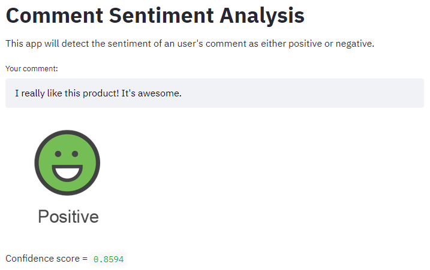

# Sentiment Analysis using Naive Bayes

<figure>
  <p align="center">
    
    <figcaption>Source: www.expressanalytics.com/sentiment-analysis</figcaption>
  </p>
</figure>

## Introduction
A dataset of sample tweets is taken from the NLTK library and used to create a sentiment analysis model. The model is built using a **Naive Bayes Classifier** trained on a dataset of positive and negative tweets after preprocessing. The model takes a list of text tokens (that make up a comment) as input and predicts whether the corresponding comment is positive or negative.


## Training
First, make sure to install all the requirements:
```
pip install -r ./requirements.txt
```

Then, run the train.py script:
```
python ./train.py --save-to ./models/naive_bayes.mdl --test-size 0.3
```


## Run the app
The *main.py* file is a **Streamlit** app and is deployed to [Streamlit Share](https://share.streamlit.io/). Visit the following link to run the app and test it:

#### [Comment Sentiment Analysis](https://share.streamlit.io/msamsami/sentiment-analysis/main/main.py) ####


<p align="center">
  
</p>
